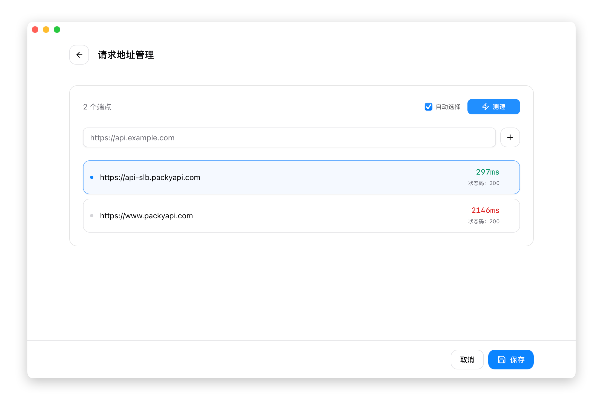

# 2.1 Add Provider

## Open the Add Panel

Click the **+** button in the top-right corner of the main interface to open the Add Provider panel.

The panel has two tabs:
- **App-specific Provider**: Only for the currently selected app (Claude/Codex/Gemini/OpenCode/OpenClaw)
- **Universal Provider**: Shared configuration across apps

## Add Using Presets

Presets are pre-configured provider templates that only require an API Key to use.

### Steps

1. Select a provider from the "Preset" dropdown
2. Name and endpoint are auto-filled
3. Enter your **API Key**
4. (Optional) Add notes
5. Click "Add"

### Common Presets

#### Claude Presets

| Preset Name | Description |
|-------------|-------------|
| Claude Official | Log in with an Anthropic official account |
| DeepSeek | DeepSeek model |
| Zhipu GLM | Zhipu AI GLM model |
| Zhipu GLM en | Zhipu AI (English version) |
| Bailian | Alibaba Cloud Bailian (Qwen) |
| Kimi | Moonshot Kimi model |
| Kimi For Coding | Kimi coding-specific model |
| StepFun | StepFun model |
| ModelScope | ModelScope community |
| KAT-Coder | KAT-Coder model |
| Longcat | Longcat AI |
| MiniMax | MiniMax model |
| MiniMax en | MiniMax (English version) |
| DouBaoSeed | DouBao Seed model |
| BaiLing | BaiLing AI |
| AiHubMix | AiHubMix aggregation service |
| SiliconFlow | SiliconFlow |
| SiliconFlow en | SiliconFlow (English version) |
| DMXAPI | DMXAPI proxy service |
| PackyCode | PackyCode proxy service |
| Cubence | Cubence service |
| AIGoCode | AIGoCode service |
| RightCode | RightCode service |
| AICodeMirror | AICodeMirror service |
| OpenRouter | Aggregation routing service |
| Nvidia | Nvidia AI service |
| Xiaomi MiMo | Xiaomi MiMo model |

> The preset list may be updated with new versions. Refer to the actual list shown in the app.

#### Codex Presets

| Preset Name | Description |
|-------------|-------------|
| OpenAI Official | Log in with an OpenAI official account |
| Azure OpenAI | Azure OpenAI service |
| AiHubMix | AiHubMix aggregation service |
| DMXAPI | DMXAPI proxy service |
| PackyCode | PackyCode proxy service |
| Cubence | Cubence service |
| AIGoCode | AIGoCode service |
| RightCode | RightCode service |
| AICodeMirror | AICodeMirror service |
| OpenRouter | Aggregation routing service |

#### Gemini Presets

| Preset Name | Description |
|-------------|-------------|
| Google Official | Log in with Google OAuth |
| PackyCode | PackyCode proxy service |
| Cubence | Cubence service |
| AIGoCode | AIGoCode service |
| AICodeMirror | AICodeMirror service |
| OpenRouter | Aggregation routing service |
| Custom | Manually configure all parameters |

#### OpenCode Presets

| Preset Name | Description |
|-------------|-------------|
| DeepSeek | DeepSeek model |
| Zhipu GLM | Zhipu AI GLM model |
| Zhipu GLM en | Zhipu AI (English version) |
| Bailian | Alibaba Cloud Bailian |
| Kimi k2.5 | Moonshot Kimi-k2.5 model |
| Kimi For Coding | Kimi coding-specific model |
| StepFun | StepFun model |
| ModelScope | ModelScope community |
| KAT-Coder | KAT-Coder model |
| Longcat | Longcat AI |
| MiniMax | MiniMax model |
| MiniMax en | MiniMax (English version) |
| DouBaoSeed | DouBao Seed model |
| BaiLing | BaiLing AI |
| Xiaomi MiMo | Xiaomi MiMo model |
| AiHubMix | AiHubMix aggregation service |
| DMXAPI | DMXAPI proxy service |
| OpenRouter | Aggregation routing service |
| Nvidia | Nvidia AI service |
| PackyCode | PackyCode proxy service |
| Cubence | Cubence service |
| AIGoCode | AIGoCode service |
| RightCode | RightCode service |
| AICodeMirror | AICodeMirror service |
| OpenAI Compatible | OpenAI-compatible interface |
| Oh My OpenCode | Oh My OpenCode service |

> The preset list is continuously updated. Refer to the actual list shown in the app.

#### OpenClaw Presets

| Preset Name | Description |
|-------------|-------------|
| DeepSeek | DeepSeek model |
| Zhipu GLM | Zhipu AI GLM model |
| Zhipu GLM en | Zhipu AI (English version) |
| Qwen Coder | Qwen coding model |
| Kimi k2.5 | Moonshot Kimi-k2.5 model |
| Kimi For Coding | Kimi coding-specific model |
| StepFun | StepFun model |
| MiniMax | MiniMax model |
| MiniMax en | MiniMax (English version) |
| KAT-Coder | KAT-Coder model |
| Longcat | Longcat AI |
| DouBaoSeed | DouBao Seed model |
| BaiLing | BaiLing AI |
| Xiaomi MiMo | Xiaomi MiMo model |
| AiHubMix | AiHubMix aggregation service |
| DMXAPI | DMXAPI proxy service |
| OpenRouter | Aggregation routing service |
| ModelScope | ModelScope community |
| SiliconFlow | SiliconFlow |
| SiliconFlow en | SiliconFlow (English version) |
| Nvidia | Nvidia AI service |
| PackyCode | PackyCode proxy service |
| Cubence | Cubence service |
| AIGoCode | AIGoCode service |
| RightCode | RightCode service |
| AICodeMirror | AICodeMirror service |
| AICoding | AICoding service |
| CrazyRouter | CrazyRouter service |
| SSSAiCode | SSSAiCode service |
| AWS Bedrock | AWS Bedrock service |
| OpenAI Compatible | OpenAI-compatible interface |

## Custom Configuration

After selecting the "Custom" preset, you need to manually edit the JSON configuration.

### Claude Configuration Format

```json
{
  "env": {
    "ANTHROPIC_API_KEY": "your-api-key",
    "ANTHROPIC_BASE_URL": "https://api.example.com"
  }
}
```

| Field | Required | Description |
|-------|----------|-------------|
| `ANTHROPIC_API_KEY` | Yes | API key |
| `ANTHROPIC_BASE_URL` | No | Custom endpoint URL |
| `ANTHROPIC_AUTH_TOKEN` | No | Alternative authentication method to API_KEY |

### Codex Configuration Format

Codex uses two configuration files:

**1. auth.json** (`~/.codex/auth.json`) - Stores API key:

```json
{
  "OPENAI_API_KEY": "your-api-key"
}
```

**2. config.toml** (`~/.codex/config.toml`) - Stores model and endpoint configuration:

```toml
# Basic configuration
model_provider = "custom"
model = "gpt-5.2"
model_reasoning_effort = "high"
disable_response_storage = true

# Custom provider configuration
[model_providers.custom]
name = "custom"
base_url = "https://api.example.com/v1"
wire_api = "responses"
requires_openai_auth = true
```

**auth.json field descriptions**:

| Field | Required | Description |
|-------|----------|-------------|
| `OPENAI_API_KEY` | Yes | API key |

**config.toml field descriptions**:

| Field | Required | Description |
|-------|----------|-------------|
| `model_provider` | Yes | Model provider name (must match `[model_providers.xxx]`) |
| `model` | Yes | Model to use (e.g., `gpt-5.2`, `gpt-4o`) |
| `model_reasoning_effort` | No | Reasoning effort: `low` / `medium` / `high` |
| `disable_response_storage` | No | Whether to disable response storage |
| `base_url` | Yes | API endpoint URL |
| `wire_api` | No | API protocol type (usually `responses`) |
| `requires_openai_auth` | No | Whether to use OpenAI authentication |


### Gemini Configuration Format

```json
{
  "env": {
    "GEMINI_API_KEY": "your-api-key",
    "GOOGLE_GEMINI_BASE_URL": "https://api.example.com"
  }
}
```

| Field | Required | Description |
|-------|----------|-------------|
| `GEMINI_API_KEY` | Yes | API key |
| `GOOGLE_GEMINI_BASE_URL` | No | Custom endpoint URL |
| `GEMINI_MODEL` | No | Specify model |

> Authentication type is automatically detected by CC Switch (PackyCode API proxy / Google OAuth / generic API Key), no manual configuration needed.

## Universal Provider

Universal providers can share configurations across Claude/Codex/Gemini/OpenCode/OpenClaw, suitable for proxy services that support multiple API formats.

### Create a Universal Provider

1. Switch to the "Universal Provider" tab
2. Click "Add Universal Provider"
3. Fill in the common configuration:
   - Name
   - API Key
   - Endpoint URL
4. Check the apps to sync to (Claude/Codex/Gemini/OpenCode/OpenClaw)
5. Save

### Sync Mechanism

Universal providers automatically sync to the selected apps:

- After modifying a universal provider, all linked app configurations are updated
- After deleting a universal provider, linked app configurations are also deleted

### Save and Sync

When editing a universal provider, you can choose:

| Action | Description |
|--------|-------------|
| Save | Save configuration only, without immediate sync |
| Save and Sync | Save configuration and immediately sync to all enabled apps |

### Manual Sync

If you need to manually trigger a sync:

1. Click the "Sync" button on the universal provider card
2. Confirm the sync operation
3. Configuration will overwrite the linked provider in each app

## Import Providers

CC Switch supports two ways to import provider configurations:

### Option 1: Deep Link Import

One-click import via `ccswitch://` protocol links:

1. Click or visit the deep link
2. CC Switch opens automatically and shows the import confirmation
3. Preview the configuration information
4. Click "Confirm Import"

**Getting deep links**:
- Obtain from shared links by others
- Create using the [online generator tool](https://farion1231.github.io/cc-switch/deplink.html)

### Option 2: Database Backup Import

Batch import from SQL backup files:

1. Open "Settings > Advanced > Data Management"
2. Click "Select File"
3. Select a previously exported `.sql` backup file
4. Click "Import"
5. Confirm to overwrite existing configuration

**Imported contents**:
- All provider configurations
- MCP server configurations
- Prompt presets
- Usage logs

> **Note**: Importing will overwrite the existing database. It is recommended to export your current configuration as a backup first. The exported file name format is `cc-switch-export-{timestamp}.sql`.

## Advanced Options

### Custom Icon

Click the icon area to the left of the name to:

- Select a preset icon
- Customize icon color

### Website Link

Enter the provider's website or console URL for quick access:

- Click the link icon on the provider card to open directly
- Useful for checking balance, obtaining API keys, etc.

### Notes

Add notes such as:

- Account purpose (personal/work)
- Plan information
- Expiration date

Notes are displayed on the provider card and are searchable.

### Endpoint Speed Test

After adding a provider, you can speed-test API endpoints:

1. Click the "Speed Test" button on the provider card
2. Add multiple endpoint URLs in the speed test panel
3. Click "Test" to run the test
4. Select the endpoint with the lowest latency

**Test results**:
- Green: Latency < 500ms (Excellent)
- Yellow: Latency 500-1000ms (Fair)
- Red: Latency > 1000ms (Slow)


