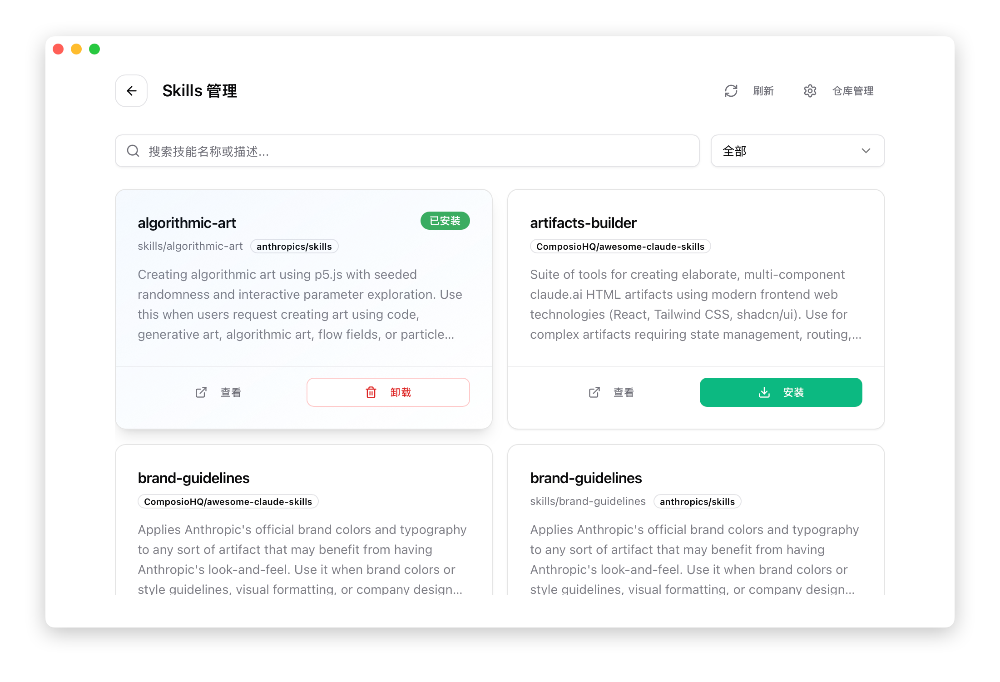

# 3.3 Skills 技能管理

## 功能说明

Skills 是可复用的能力扩展，让 AI 工具获得特定领域的专业能力。

技能以文件夹形式存在，包含：

- 提示词模板
- 工具定义
- 示例代码

## 支持的应用

Skills 功能支持所有四种应用：

- **Claude Code**
- **Codex**
- **Gemini CLI**
- **OpenCode**

## 打开 Skills 页面

点击顶部导航栏的 **Skills** 按钮。

> 注意：Skills 按钮在所有应用模式下均可见。

## 页面概览


## 发现技能

### 预配置仓库

CC Switch 预配置了以下 GitHub 仓库：

| 仓库           | 说明                     |
| -------------- | ------------------------ |
| Anthropic 官方 | Anthropic 提供的官方技能 |
| ComposioHQ     | 社区维护的技能集合       |
| 社区精选       | 精选的高质量技能         |


### 搜索过滤

CC Switch 提供强大的搜索和过滤功能：

#### 搜索框

- 支持按技能名称搜索
- 支持按技能描述搜索
- 支持按目录名称搜索
- 实时过滤，输入即搜索

#### 状态过滤

使用下拉菜单按安装状态过滤：

| 选项   | 说明               |
| ------ | ------------------ |
| 全部   | 显示所有技能       |
| 已安装 | 仅显示已安装的技能 |
| 未安装 | 仅显示未安装的技能 |



#### 组合使用

搜索和过滤可以组合使用：

- 先选择「已安装」过滤
- 再输入关键词搜索
- 结果显示匹配数量

### 刷新列表

点击「刷新」按钮重新扫描仓库，获取最新技能。

## 安装技能

### 操作步骤

1. 找到要安装的技能卡片
2. 点击「安装」按钮
3. 等待安装完成

### 安装位置

| 应用     | 安装目录              |
| -------- | --------------------- |
| Claude   | `~/.claude/skills/`   |
| Codex    | `~/.codex/skills/`    |
| Gemini   | `~/.gemini/skills/`   |
| OpenCode | `~/.opencode/skills/` |

### 安装内容

安装会将技能文件夹复制到本地：

```
~/.claude/skills/
└── skill-name/
    ├── README.md
    ├── prompt.md
    └── tools/
        └── ...
```

## 卸载技能

### 操作步骤

1. 找到已安装的技能卡片
2. 点击「卸载」按钮
3. 确认卸载

### 卸载效果

- 删除本地技能文件夹
- 更新安装状态

## 仓库管理

### 打开仓库管理

点击页面顶部的「仓库管理」按钮。

### 添加自定义仓库

1. 点击「添加仓库」
2. 填写仓库信息：
   - Owner：GitHub 用户名或组织名
   - Name：仓库名称
   - Branch：分支名（默认 main）
   - Subdirectory：技能所在子目录（可选）
3. 点击「添加」

### 仓库格式

```
https://github.com/{owner}/{name}/tree/{branch}/{subdirectory}
```

示例：

```
Owner: anthropics
Name: claude-skills
Branch: main
Subdirectory: skills
```

### 删除仓库

1. 在仓库列表中找到要删除的仓库
2. 点击「删除」按钮
3. 确认删除

删除仓库后，该仓库的技能不会从列表中消失，但无法再更新。

## 技能卡片信息

每个技能卡片显示：

| 信息 | 说明            |
| ---- | --------------- |
| 名称 | 技能名称        |
| 描述 | 功能说明        |
| 来源 | 所属仓库        |
| 状态 | 已安装 / 未安装 |

## 技能更新

目前不支持自动更新。如需更新技能：

1. 卸载现有技能
2. 刷新列表
3. 重新安装

### 技能列表为空

可能原因：

- 网络问题，无法访问 GitHub
- 仓库配置错误

解决方法：

- 检查网络连接
- 点击「刷新」重试
- 检查仓库配置

### 安装失败

可能原因：

- 网络问题
- 磁盘空间不足
- 权限问题

解决方法：

- 检查网络连接
- 检查磁盘空间
- 检查目录权限
